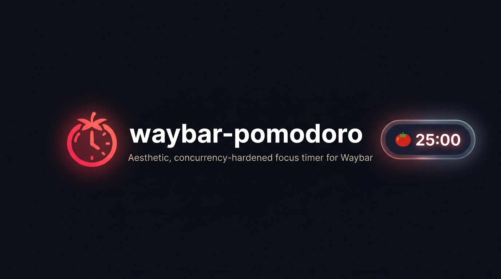

<div align="center">



# Waybar Pomodoro

**Aesthetic, zero-CPU streaming focus timer for Waybar and Wayland compositors.**

<br />

[](https://github.com/qwerpik/waybar-pomodoro/stargazers)

<br />

[](https://github.com/qwerpik/waybar-pomodoro/actions/workflows/test.yml)
&nbsp;
[](https://github.com/qwerpik/waybar-pomodoro/releases)
&nbsp;
[](https://www.python.org/)
&nbsp;
[](https://opensource.org/licenses/MIT)
&nbsp;
[](CONTRIBUTING.md)

---

Stay in deep focus without leaving your keyboard or cluttering your workspace. `waybar-pomodoro` integrates directly into your Waybar status bar with zero background CPU overhead, atomic race-free file locks, Focus DND silencing, and interactive mouse-wheel adjustments.

[Quickstart](#quickstart) • [How It Works](#how-it-works) • [Features](#features) • [Installation](#installation) • [Waybar Config](#waybar-configuration) • [Themes](#theme-presets) • [Docs](docs/) • [Contributing](#contributing)

</div>

<br />

<a id="why"></a>
<table>
<tr>
<td width="33%" valign="top">

**⚡ Zero baggage & 0% CPU**
Pure Python 3, no pip deps. Kernel `epoll_wait` streaming daemon.

</td>
<td width="33%" valign="top">

**🔒 Never corrupts**
Advisory locks + atomic writes + sleep drift resilience.

</td>
<td width="33%" valign="top">

**🎯 Feels native**
Auto-pause on screen lock, Focus DND, lifecycle event hooks, popup menu.

</td>
</tr>
</table>

<a id="try-in-30-seconds"></a>
<a id="quickstart"></a>
> [!TIP]
> **Try in 30 seconds**
> ```bash
> git clone https://github.com/qwerpik/waybar-pomodoro.git
> cd waybar-pomodoro && ./install.sh
> waybar-pomodoro setup mangowm --append   # or hyprland, sway, i3
> waybar-pomodoro toggle && waybar-pomodoro status --heatmap
> ```

<a id="how-it-works"></a>
<table>
<tr>
<td valign="top" width="50%">

**🟩 In the bar (0% CPU Streaming)**
```jsonc
"custom/pomodoro": {
    "format": "{}",
    "return-type": "json",
    "exec": "waybar-pomodoro stream",
    "on-click": "waybar-pomodoro toggle",
    "on-click-right": "waybar-pomodoro menu",
    "on-scroll-up": "waybar-pomodoro adjust +1m",
    "on-scroll-down": "waybar-pomodoro adjust -1m"
}
```
`🍅 25:00` → `☕ 05:00` → `🌴 15:00`

</td>
<td valign="top" width="50%">

**✨ On hover & in terminal**
```text
🍅 Focus [2/4]  Running
▰▰▰▰▰▰▱▱▱▱▱▱ 12:30 (50%)
Today: 3 sessions • 90m
Streak: 5 days 🔥
```
```bash
stats --heatmap  # terminal
stats --chart    # SVG in browser
```

</td>
</tr>
</table>

---

<a id="features"></a>
## ✨ Features

| | Capability | What you get |
| :--- | :--- | :--- |
| ⚡ | **0.00% CPU Streaming** | Persistent `stream` daemon with inotify state reactions and integer-second alignment. |
| 🔌 | **Compositors & Hooks** | Turnkey CLI setup (`setup`) for MangoWM, Hyprland, Sway, i3, plus shell event hooks. |
| 🔒 | **Screen Lock & Idle** | Auto-pause on lock/inactivity (`idle-pause`), resume on unlock (`idle-resume`). |
| 🔕 | **Focus DND** | Auto-silence notifications during work sessions (`swaync`, `dunst`, `mako`). |
| 🛡️ | **Race-free & Resilient** | `fcntl.flock` + atomic writes + microsecond sleep/suspend drift detection. |
| 🎯 | **Native bar UX** | Click toggle, right-click menu, middle-click skip, scroll `±1m`, Pango progress bar. |
| 🟩 | **Study tracker** | Terminal heatmap (`stats --heatmap`) + SVG chart (`stats --chart`), streaks, JSON/CSV. |

<details>
<summary><b>Full feature list (13 items)</b></summary>

- **⚡ Zero External Dependencies**: Written in pure Python 3 using standard libraries. No bloated virtual environments or pip dependencies required.
- **🔒 Race-Free Concurrency**: Process synchronization via POSIX advisory locks (`fcntl.flock`) and atomic file writes (`fsync` + rename) ensures rapid mouse wheel adjustments never drop increments or corrupt state files.
- **🎯 Instant Waybar Updates**: Uses Waybar's realtime signals (`SIGRTMIN+8`) for zero-latency UI updates on click or wheel scroll.
- **🖱️ Full Mouse & Wheel Interaction**:
  - **Left Click**: Start / Pause / Resume
  - **Right Click**: Open Interactive Popup Menu (`waybar-pomodoro menu`) or Reset
  - **Middle Click**: Skip to next phase (Work ↔ Break)
  - **Scroll Wheel**: Fine-tune timer on the fly (`+1m` / `-1m`)
- **🪟 Interactive Popup Menu**: Right-click to open an interactive desktop popup menu (auto-detects Rofi, Wofi, Fuzzel, Tofi, Zenity, or GTK) with quick sprint presets (15m, 25m, 45m, 60m), controls, and adjustments.
- **🟩 GitHub-Style Study Tracker**: Visual contribution heatmap in terminal (`stats --heatmap`) and standalone vector SVG chart (`stats --chart`) with streak badges and daily focus history.
- **🔇 Minimalist & Distraction-Free**: Supports clean numbers-only mode (e.g. `30:00`), icon mode (`🍅 30:00`), or custom formatted templates.
- **🏷️ Full Waybar Protocol Support**: Exposes `text`, `alt`, `tooltip`, `class`, and `percentage` fields, allowing native `{alt}` token and Waybar `format-icons` mapping.
- **🔔 Desktop & Sound Alerts**: Native `notify-send` alerts with custom categories (`timer`), notification replacement IDs (no notification spam), and audio chime playback via `canberra-gtk-play`, `pw-play`, `paplay`, `ogg123`, `ffplay`, or `mpv`.
- **💤 Suspend/Sleep Protection**: Intelligently detects system suspend/sleep to prevent phantom sessions or delayed alarm blasts upon waking.
- **📊 Focus Statistics & Streaks**: Persistently tracks completed Pomodoro sessions, focus time in minutes/hours, daily streaks (with day-rollover preservation), and JSON/CSV export.
- **🎨 Theme Presets Included**: Ready-to-use CSS stylesheets for Minimal Black, Gruvbox, Catppuccin Mocha, Nord, Tokyo Night, and Dracula.

</details>

---

## 📚 Documentation & Deep Dives

* 📖 **[Multi-Distribution Installation Guide](docs/INSTALLATION.md)**: Distro guides (Arch, Debian/Ubuntu PEP 668, Fedora, Nix), `$PATH` configuration, audio backend priorities, and font setup.
* 💻 **[Command Line Interface (CLI) & Scripting Guide](docs/CLI.md)**: Complete CLI command matrix, global flags, scripting recipes, rofi/dmenu launcher, and window manager keybindings.
* 🔧 **[Configuration Guide & Options Reference](docs/CONFIGURATION.md)**: Exhaustive reference for all 21 configuration options, format tokens, sound themes, and focus recipes.
* 🔬 **[Engineering Case Study & Architecture](docs/ARTICLE.md)**: Deep dive into POSIX advisory locking (`fcntl.flock`), atomic durability (`os.fsync`), system suspend drift detection, and Pango progress rendering.
* 🚀 **[Showcase & Community Pack](docs/SHOWCASE.md)**: Reddit post templates, release notes, and configuration snippets for **Hyprland**, **Sway**, and **MangoWM**.
* 🎨 **[CSS Capsule Themes](docs/themes/)**: Modern pill badges for Catppuccin Mocha, Dracula, Gruvbox, Nord, Tokyo Night, and Minimal Black.

---

<a id="installation"></a>
## 🚀 Installation

```bash
git clone https://github.com/qwerpik/waybar-pomodoro.git
cd waybar-pomodoro && ./install.sh
```

Debian/Ubuntu/Fedora (PEP 668 safe): `pipx install git+https://github.com/qwerpik/waybar-pomodoro.git` · Arch: `cd packaging && makepkg -si` · Nix: see docs.

👉 Full distro guides, `$PATH`, audio backends: **[`docs/INSTALLATION.md`](docs/INSTALLATION.md)**.

<details>
<summary><b>All install methods</b></summary>

| Distribution | Recommended Method | Command |
| :--- | :--- | :--- |
| **Arch Linux / Artix** | Local PKGBUILD | `cd packaging && makepkg -si` |
| **Debian / Ubuntu / Mint** | `pipx` (PEP 668 safe) | `pipx install git+https://github.com/qwerpik/waybar-pomodoro.git` |
| **Fedora** | `pipx` or `./install.sh` | `pipx install git+https://github.com/qwerpik/waybar-pomodoro.git` |
| **NixOS / Nix** | Nix Flake / `nix-shell` | See [`docs/INSTALLATION.md`](docs/INSTALLATION.md#4-nixos--nix) |
| **Any Linux (User)** | Standalone Installer | `./install.sh` |

### Option 1: Quick Install Script (Zero Dependencies)

Clone the repository and run the install script:

```bash
git clone https://github.com/qwerpik/waybar-pomodoro.git
cd waybar-pomodoro
./install.sh
```

This installs the binary to `~/.local/bin/waybar-pomodoro` and creates a default config in `~/.config/waybar-pomodoro/config.json`.

*(Ensure `~/.local/bin` is in your `$PATH` — see [`docs/INSTALLATION.md`](docs/INSTALLATION.md#1-verifying-and-adding-localbin-to-path))*

### Option 2: Pipx (Recommended for Debian, Ubuntu, Fedora)

Install isolated from GitHub without cloning:

```bash
pipx install git+https://github.com/qwerpik/waybar-pomodoro.git
```

Or from a local clone:

```bash
pipx install .
```

### Option 3: Arch Linux (PKGBUILD)

```bash
cd packaging
makepkg -si
```

### Option 4: Nix / NixOS (Flakes & Home Manager)

Run directly via Nix Flake:
```bash
nix run github:qwerpik/waybar-pomodoro -- status
```

Or declare via Home Manager module (`waybar-pomodoro.homeManagerModules.default`):
```nix
programs.waybar-pomodoro.enable = true;
```
*(See [`docs/INSTALLATION.md`](docs/INSTALLATION.md#4-nixos--nix) for full declarative configuration)*

</details>

---

<a id="waybar-configuration"></a>
## ⚙️ Waybar Configuration

```jsonc
"custom/pomodoro": {
    "exec": "waybar-pomodoro status",
    "on-click": "waybar-pomodoro toggle",
    "on-click-right": "waybar-pomodoro menu",
    "on-scroll-up": "waybar-pomodoro adjust +1m",
    "interval": 1, "signal": 8
}
```

👉 Full module, `format-icons`, Pango tooltip, popup menu, heatmap, CSS: **[`docs/CONFIGURATION.md`](docs/CONFIGURATION.md)** and **[`docs/CLI.md`](docs/CLI.md)**.

<details>
<summary><b>Full Waybar module + tooltip + menu + themes</b></summary>

### 1. Add module to `~/.config/waybar/config.jsonc`

Add `"custom/pomodoro"` to your `modules-center`, `modules-left`, or `modules-right`:

```jsonc
{
    // ...
    "modules-center": [
        "custom/pomodoro"
    ],
    // ...
    "custom/pomodoro": {
        "format": "{}",
        "return-type": "json",
        "exec": "waybar-pomodoro stream",
        "on-click": "waybar-pomodoro toggle",
        "on-click-right": "waybar-pomodoro menu",
        "on-click-middle": "waybar-pomodoro skip",
        "on-scroll-up": "waybar-pomodoro adjust +1m",
        "on-scroll-down": "waybar-pomodoro adjust -1m"
    }
}
```

#### Optional: Waybar `format-icons` via `{alt}`

Because `waybar-pomodoro` outputs the native `alt` field (`idle`, `work`, `short_break`, `long_break`, `paused`), you can also let Waybar format icons natively:

```jsonc
    "custom/pomodoro": {
        "format": "{icon} {text}",
        "return-type": "json",
        "exec": "waybar-pomodoro status --plain",
        "format-icons": {
            "work": "🍅",
            "short_break": "☕",
            "long_break": "🌴",
            "paused": "⏸",
            "idle": "⏱"
        },
        "on-click": "waybar-pomodoro toggle",
        "on-click-right": "waybar-pomodoro menu",
        "interval": 1,
        "signal": 8
    }
```

### 2. Rich Pango Tooltip & Progress Bar

Hovering over the module in Waybar renders a rich Pango-formatted tooltip with a 12-segment character progress bar, session ratio counter, controls cheat-sheet, and daily streak tracking:

```text
┌──────────────────────────────────────────────┐
│ 🍅 Focus Session [2/4]               Running │
│ ▰▰▰▰▰▰▱▱▱▱▱▱  12:30 (50%)                    │
│ ───────────────────────────────────────────  │
│ • Left-click:   Toggle / Pause               │
│ • Right-click:  Menu / Reset                 │
│ • Middle-click: Skip Phase                   │
│ • Scroll:       ±1 min                       │
│ ───────────────────────────────────────────  │
│ Today:  3 session(s) • 90m focus             │
│ Streak: 5 day(s) 🔥                          │
└──────────────────────────────────────────────┘
```

### 3. Interactive Right-Click Popup Menu

Right-clicking the module opens a sleek popup launcher menu (`waybar-pomodoro menu`) that integrates automatically with your desktop theme. It auto-detects `rofi`, `wofi`, `fuzzel`, `tofi`, `zenity`, or `gtk` across all Wayland compositors:

- **Playback Controls**: Toggle, Pause, Resume, Skip Phase, Reset, or Stop.
- **Quick Duration Presets**: `⚡ 15m Sprint`, `🍅 25m Classic`, `🎯 45m Deep Work`, `🏆 60m Marathon`.
- **Quick Adjustments**: Add `+5m` or Subtract `-5m` immediately.
- **Custom Time Prompt**: Type any duration on the fly (e.g. `35m`).
- **One-Click Analytics**: Launch the study tracker or export your contribution chart.

*(Optional)* For users who prefer Waybar's native GTK context menu directly anchored to the bar, see the ready-to-use [`docs/waybar-menu.xml`](docs/waybar-menu.xml) recipe in [Configuration Guide](docs/CONFIGURATION.md#recipe-4-interactive-right-click-popup-menu).

### 4. GitHub-Style Study Tracker (Heatmap & Chart)

Track your focus habit with a visual contribution tracker just like GitHub's contribution graph!

- **Terminal Unicode Heatmap** (`waybar-pomodoro stats --heatmap`):
  Renders a 7-row (Mon–Sun) activity matrix with 4-level color-graded intensity, month headers, active streak, and all-time records.
- **Vector SVG / Browser Chart** (`waybar-pomodoro stats --chart`):
  Generates and opens a standalone vector graphic with hover tooltips (`date: N sessions, M mins`) styled to your favorite theme (`github-dark`, `catppuccin`, `gruvbox`, `tokyo-night`, `nord`).

```bash
# Display terminal heatmap
waybar-pomodoro stats --heatmap

# Open standalone SVG contribution chart in browser
waybar-pomodoro stats --chart --theme catppuccin
```

### 5. Style in `~/.config/waybar/style.css`

Include your preferred theme from [`docs/themes/`](docs/themes/) directly in your Waybar `style.css`:

```css
@import "path/to/waybar-pomodoro/docs/themes/gruvbox.css";
```

<details>
<summary>🎨 <b>Click to expand standalone inline CSS (Gruvbox Capsule Pill)</b></summary>

```css
#custom-pomodoro {
    background-color: #282828;
    color: #ebdbb2;
    padding: 2px 14px;
    margin: 3px 4px;
    border-radius: 9999px;
    border: 1px solid rgba(235, 219, 178, 0.15);
    font-weight: bold;
    transition: all 0.2s ease-in-out;
}

#custom-pomodoro:hover {
    border-color: rgba(235, 219, 178, 0.4);
}

#custom-pomodoro.stopped,
#custom-pomodoro.idle {
    background-color: #282828;
    color: #a89984;
    border-color: rgba(168, 153, 132, 0.25);
}

#custom-pomodoro.work {
    background-color: #382321;
    color: #ea6962;
    border-color: rgba(234, 105, 98, 0.45);
}

#custom-pomodoro.break {
    background-color: #2b331f;
    color: #b8bb26;
    border-color: rgba(184, 187, 38, 0.45);
}

#custom-pomodoro.long-break {
    background-color: #20332e;
    color: #8ec07c;
    border-color: rgba(142, 192, 124, 0.45);
}

#custom-pomodoro.paused {
    background-color: #37311d;
    color: #fabd2f;
    border-color: rgba(250, 189, 47, 0.45);
    opacity: 0.85;
}
```
</details>

<a id="theme-presets"></a>
### 🎨 Theme Presets

Ready-to-use capsule pill stylesheets located in [`docs/themes/`](docs/themes/):

| Theme | Work / Break Accents | Vibe | File Link |
| :--- | :--- | :--- | :--- |
| **Catppuccin Mocha** | `#f38ba8` (Red) / `#a6e3a1` (Green) | Pastel cozy dark | [`catppuccin-mocha.css`](docs/themes/catppuccin-mocha.css) |
| **Tokyo Night** | `#f7768e` (Red) / `#9ece6a` (Green) | Cyber nocturnal neon | [`tokyo-night.css`](docs/themes/tokyo-night.css) |
| **Nord** | `#bf616a` (Aurora) / `#a3be8c` (Green) | Arctic frost muted | [`nord.css`](docs/themes/nord.css) |
| **Gruvbox Dark** | `#ea6962` (Red) / `#b8bb26` (Green) | Warm retro earth | [`gruvbox.css`](docs/themes/gruvbox.css) |
| **Dracula** | `#ff5555` (Red) / `#50fa7b` (Green) | High contrast gothic | [`dracula.css`](docs/themes/dracula.css) |
| **Minimal Black** | `#ffffff` / `#777777` | Pure stealth monochrome | [`minimal-black.css`](docs/themes/minimal-black.css) |

</details>

### Reload Waybar

```bash
pkill -SIGUSR2 waybar
```

---

## 📖 Command Line Interface (CLI)

`waybar-pomodoro` is fully controllable directly from your terminal, custom scripts, or window manager keybindings:

```bash
waybar-pomodoro toggle      # Start, pause, or resume timer
waybar-pomodoro reset       # Reset timer back to configured work duration
waybar-pomodoro adjust +5m  # Fine-tune timer on the fly (+1m, -1m, +5m)
waybar-pomodoro stats       # Display daily focus statistics and streak summary
```

👉 **For the complete command matrix, global flags, scripting examples, and window manager keybindings (Hyprland, Sway, MangoWM), see [`docs/CLI.md`](docs/CLI.md).**

---

## 🔧 Configuration (`config.json`)

Configuration is stored at `~/.config/waybar-pomodoro/config.json` (generate with `waybar-pomodoro config --init`).

### Key Settings

| Option | Type | Default | Description |
| :--- | :--- | :--- | :--- |
| `work_duration` | `int` | `30` | Work/focus duration in minutes (`1` – `1440`). |
| `short_break_duration` | `int` | `5` | Short break duration in minutes (`1` – `360`). |
| `long_break_duration` | `int` | `15` | Long break duration in minutes (`1` – `360`). |
| `cycles_before_long_break` | `int` | `4` | Number of work sessions before triggering a long break. |
| `style` | `string` | `"minimal"` | Display style: `"minimal"` (digits only), `"icon"`, or `"custom"`. |
| `sound_enabled` | `bool` | `true` | Audio chimes upon completion (`canberra`, `pipewire`, `pulse`). |
| `auto_start_break` | `bool` | `true` | Automatically begin break countdown when work ends. |
| `auto_start_work` | `bool` | `true` | Automatically begin next work session when break ends. |

<details>
<summary>⚙️ <b>Click to expand full default config.json template</b></summary>

```json
{
  "work_duration": 30,
  "short_break_duration": 5,
  "long_break_duration": 15,
  "cycles_before_long_break": 4,
  "style": "minimal",
  "format_work": "{time}",
  "format_short_break": "{time}",
  "format_long_break": "{time}",
  "format_paused": "⏸ {time}",
  "format_idle": "{time}",
  "icon_work": "🍅",
  "icon_short_break": "☕",
  "icon_long_break": "🌴",
  "icon_paused": "⏸",
  "icon_idle": "⏱",
  "sound_enabled": true,
  "sound_work_end": "/usr/share/sounds/freedesktop/stereo/alarm-clock-elapsed.oga",
  "sound_break_end": "/usr/share/sounds/freedesktop/stereo/complete.oga",
  "notification_enabled": true,
  "notification_urgency_work_end": "critical",
  "notification_urgency_break_end": "normal",
  "notification_timeout": 10000,
  "notification_category": "timer",
  "auto_start_break": true,
  "auto_start_work": true,
  "waybar_signal": 8
}
```
</details>

👉 **For the complete configuration reference (all 21 parameters, custom token formatting `{cycle}`, `{phase}`, audio fallbacks, and focus recipes), see [`docs/CONFIGURATION.md`](docs/CONFIGURATION.md).**

---

## 📊 Statistics Tracking

`waybar-pomodoro` automatically logs every completed focus session to `~/.local/share/waybar-pomodoro/stats.json`.

View your stats at any time with `waybar-pomodoro stats`:

```text
Pomodoro Statistics
────────────────────────────────────
Today:
  • Completed Sessions : 4
  • Focus Time         : 120 min

Overall:
  • Total Sessions     : 28
  • Total Focus Time   : 14.0 hours
  • Daily Streak       : 5 day(s)
────────────────────────────────────
```

The Waybar tooltip also displays today's completed session count and active streak with GTK Pango formatting!

---

## 🧪 Running Tests & Quality Checks

```bash
make check   # pytest + ruff + mypy --strict
```

---

<a id="contributing"></a>
## 🤝 Contributing

Contributions, bug reports, and theme submissions are warmly welcome!

1. Fork the repo and create your branch (`git checkout -b feature/my-feature`).
2. Run `make check` to verify tests, formatting, and strict type checks.
3. Submit a Pull Request.

See [`CONTRIBUTING.md`](CONTRIBUTING.md) for full guidelines.

---

## ⭐ Star History

[](https://star-history.com/#qwerpik/waybar-pomodoro&Date)

---

<div align="center">

Built by [qwerpik](https://github.com/qwerpik)

<br />

**If this project helps you stay productive, give it a star!**

[](https://github.com/qwerpik/waybar-pomodoro/stargazers)

<br />

Distributed under the [MIT License](LICENSE) © 2026 [qwerpik](https://github.com/qwerpik).

</div>
